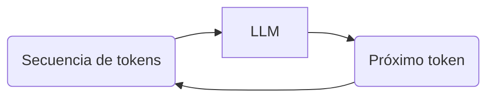
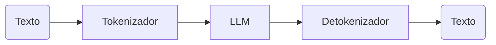
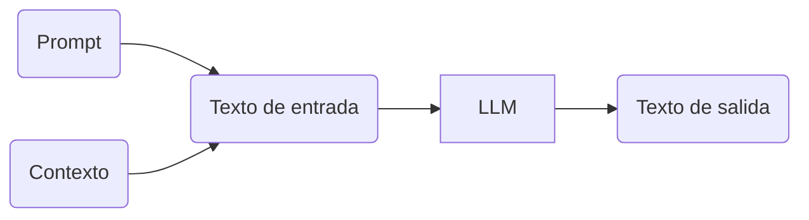
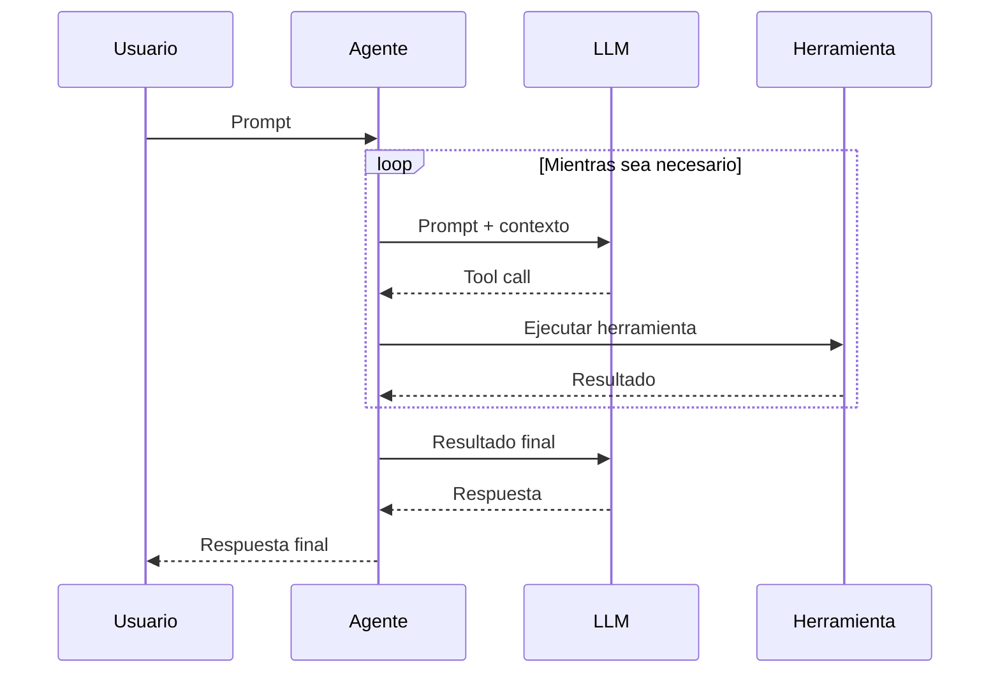

---
theme:
  path: ./theme.yaml
---

¿Qué queremos explorar en este taller?
======================================

<!-- alignment: center -->

> ​
> ​ La IA como participante en el proceso completo de desarrollo y ciclo de vida de un producto de software.
> ​

<!-- new_line -->

<!-- pause -->

```text
🎨 Diseño
```

<!-- pause -->
 ↓
```text
🛠️ Desarrollo
```
<!-- pause -->
 ↓
```text
🧪 Testing
```
<!-- pause -->
 ↓
```text
🚀 Puesta en producción
```
<!-- pause -->
 ↓
```text
📊 Observabilidad
```
<!-- pause -->
 ↓
```text
🧯 Troubleshooting
```

<!-- end_slide -->

De asistente a agente
=====================

> ​
> ​ Implicación de la IA en el proceso de desarrollo.
> ​

<!-- pause -->

<!-- new_lines: 2 -->

<!-- column_layout: [5, 7, 2, 2, 2] -->

<!-- column: 0 -->
​
<!-- column: 1 -->
​
<!-- column: 2 -->
Control del proceso
<!-- column: 3 -->
Comprensión
<!-- column: 4 -->
Velocidad

<!-- reset_layout -->

<!-- column_layout: [5, 7, 2, 2, 2] -->

<!-- column: 0 -->
Autocompletado
<!-- column: 1 -->
GitHub Copilot, Tabnine
<!-- column: 2 -->
🧭🧭🧭🧭🧭
<!-- column: 3 -->
💡💡💡💡💡

<!-- column: 4 -->
⚡

<!-- reset_layout -->

<!-- pause -->

<!-- column_layout: [5, 7, 2, 2, 2] -->

<!-- column: 0 -->
Asistentes de código
<!-- column: 1 -->
Cursor, Windsurf, Kiro
<!-- column: 2 -->
🧭🧭🧭🧭
<!-- column: 3 -->
💡💡💡💡

<!-- column: 4 -->
⚡⚡⚡

<!-- reset_layout -->

<!-- pause -->

<!-- column_layout: [5, 7, 2, 2, 2] -->

<!-- column: 0 -->
Agentes autónomos
<!-- column: 1 -->
Claude, Codex, OpenCode
<!-- column: 2 -->
🧭🧭🧭
<!-- column: 3 -->
💡💡💡

<!-- column: 4 -->
⚡⚡⚡⚡

<!-- reset_layout -->

<!-- pause -->

<!-- column_layout: [5, 7, 2, 2, 2] -->

<!-- column: 0 -->
Vibe coding
<!-- column: 1 -->
Lovable, Bolt, v0
<!-- column: 2 -->
🧭
<!-- column: 3 -->
-

<!-- column: 4 -->
⚡⚡⚡⚡⚡

<!-- reset_layout -->

<!-- end_slide -->

Desde la IA clásica a los LLM
=============================

<!-- alignment: center -->

<!-- pause -->

```text
Motores de reglas
```

<!-- pause -->
 ↓
```text
Métodos probabilísticos
```

<!-- pause -->
 ↓
```text
Clasificación (supervisada y no supervisada)
```

<!-- pause -->
 ↓
```text
Redes neuronales
```

<!-- pause -->
 ↓
```text
Deep Learning
```

<!-- pause -->
 ↓
```text
Modelos de lenguaje de gran tamaño (LLM)
```

<!-- end_slide -->

Qué hace un LLM
===============

> ​
> ​ Un LLM trabaja sobre texto dividido en *tokens*.
> ​

<!-- pause -->

<!-- new_lines: 4 -->

<!-- alignment: center -->



<!-- pause -->

<!-- new_lines: 4 -->




<!-- end_slide -->

El LLM necesita un contexto
===========================

> ​
> ​ Un LLM no tiene memoria por lo que en cada interacción necesita que se le proporcione un *contexto*.
> ​

<!-- pause -->

<!-- new_lines: 4 -->

<!-- alignment: center -->




<!-- end_slide -->

Caracterización de un agente
============================

> ​
> ​ Un agente coordina un LLM, gestiona el contexto y utiliza herramientas para constrir una respuesta.
> ​


<!-- new_lines: 2 -->



<!-- end_slide -->
