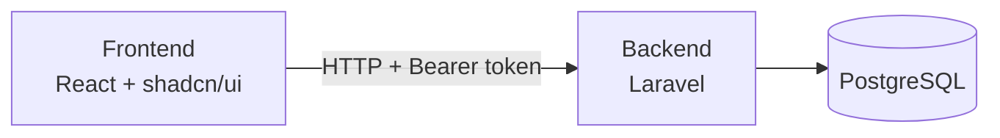
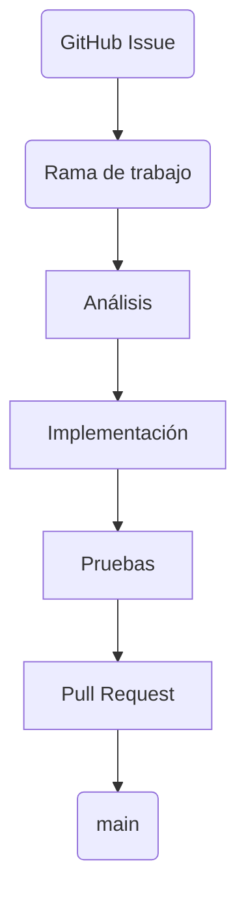
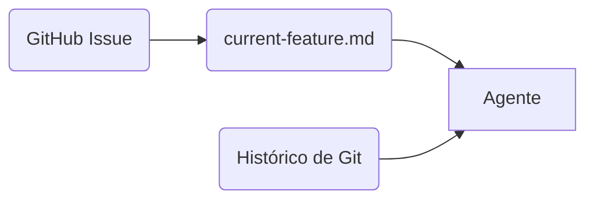
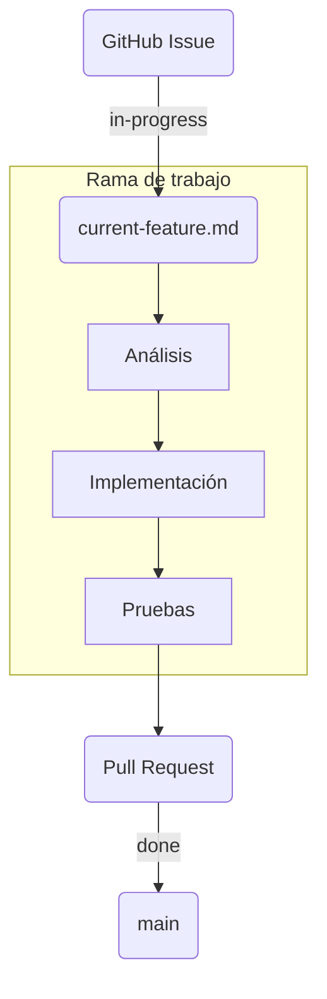

---
theme:
  path: ./theme.yaml
---

Motor de reservas de hotel
==========================

<!-- alignment: center -->

> ​
> ​ Funcionalidades
> ​

<!-- new_lines: 4 -->

<!-- column_layout: [1, 1, 1] -->

<!-- column: 0 -->

## Consultar disponibilidad

<!-- new_line -->

- El usuario puede consultar habitaciones
disponibles entre dos fechas.
- Se puede indicar, opcionalmente, hotel, tipo de habitación o ambos.

<!-- column: 1 -->

## Crear una reserva

<!-- new_line -->

- El usuario puede crear una reserva
para una habitación de hotel, fechas
y número de paxes.

<!-- column: 2 -->

## Consultar reservas

<!-- new_line -->

- El usuario puede consultar las reservas
creadas entre dos fechas.

<!-- reset_layout -->

<!-- end_slide -->

Motor de reservas de hotel
==========================

<!-- alignment: center -->

> ​
> ​ Conceptos del dominio
> ​

<!-- alignment: center -->

<!-- new_lines: 2 -->

<!-- column_layout: [1, 1, 1] -->

<!-- column: 0 -->

## Hotel

- Tiene un nombre
- Tiene un código
- Tiene una lista de habitaciones de cierto tipo
- Se conoce el número de habitaciones de cada tipo

<!-- column: 1 -->

## Tipo de habitación

- Tiene un nombre
- Tiene un código
- Tiene una ocupación máxima

<!-- column: 2 -->

## Reserva

- Es entre dos fechas: checkin y checkout
- Es en un hotel
- Para un tipo de habitación
- Para un número de paxes

<!-- reset_layout -->

<!-- end_slide -->

Motor de reservas de hotel
==========================

> ​
> ​ Arquitectura del sistema
> ​

<!-- new_lines: 4 -->

<!-- end_slide -->

Flujo de trabajo
================

> ​
> ​ Flujo general trunk based
> ​

<!-- end_slide -->

Contexto para el agente
=======================

> ​
> ​ El contexto mantiene los detalles del trabajo de la issue entre sesiones.
> ​

<!-- new_lines: 4 -->

<!-- end_slide -->

Flujo de trabajo
================

> ​
> ​ La issue se marca como *in-progress* al iniciar el trabajo y como *done* cuando la PR está lista para mergear.
> ​

<!-- new_lines: 4 -->

