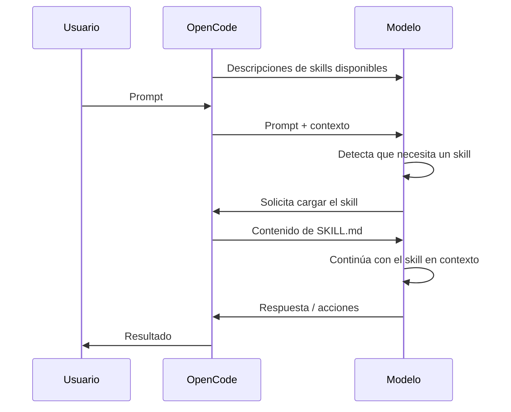
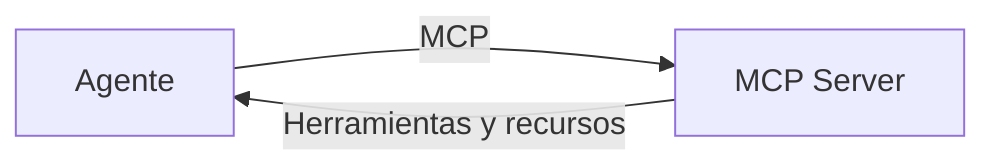

---
theme:
  path: ./theme.yaml
---

Comandos
========

> ​
> ​ Un **comando** es una instrucción explícita que puede invocarse para ejecutar una tarea o un flujo de trabajo concreto.
> ​

<!-- pause -->

<!-- new_lines: 4 -->

Ejecución:

```bash
/review-dependencies backend
```
<!-- pause -->

<!-- new_lines: 4 -->

Definición:

```markdown
---
description: Revisa las dependencias de un proyecto
---

Revisa las dependencias del proyecto en `$ARGUMENTS`.

Para ello:

1. Identifica el sistema de gestión de dependencias utilizado.
2. Analiza las dependencias declaradas y sus versiones.
3. Detecta dependencias desactualizadas, incompatibles o potencialmente problemáticas.
4. Comprueba si existen conflictos entre dependencias.
5. Presenta los problemas encontrados y explica su impacto.
6. No modifiques ningún fichero.

No ejecutes cambios automáticamente. Limítate a analizar y presentar los resultados.
```

<!-- end_slide -->

Skills
======

> ​
> ​ Un **skill** es un conjunto de instrucciones especializadas y reutilizables que el agente puede cargar cuando resultan relevantes para una tarea.
> ​

<!-- pause -->

<!-- new_lines: 4 -->

Uso:

```text
Prompt: Necesito revisar el API de tasks y verificar que es consistente.
```

<!-- pause -->

<!-- new_lines: 4 -->

Definición:

```markdown
---
name: rest-api-review
description: Reglas y procedimiento para revisar APIs REST
---

Al revisar una API REST:

1. Identifica los recursos y sus relaciones.
2. Comprueba que los endpoints utilizan correctamente los métodos HTTP.
3. Revisa los códigos de estado utilizados.
4. Comprueba la validación de parámetros y cuerpos de las peticiones.
5. Revisa la coherencia de los formatos de respuesta.
6. Comprueba los casos de error.
7. Señala inconsistencias y propone mejoras.

No modifiques el código. Presenta primero los problemas encontrados.
```
<!-- end_slide -->

Skills
======

> ​
> ​ Un **skill** se carga en el contexto a pedido del modelo cuando este lo solicita.
> ​



<!-- end_slide -->

MCP
===

> ​
> ​ **MCP (Model Context Protocol)** es un protocolo que permite conectar un agente con herramientas y fuentes de información externas.
> ​

<!-- new_lines: 4 -->



